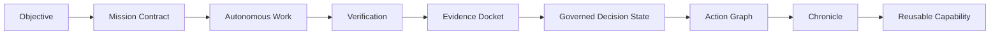
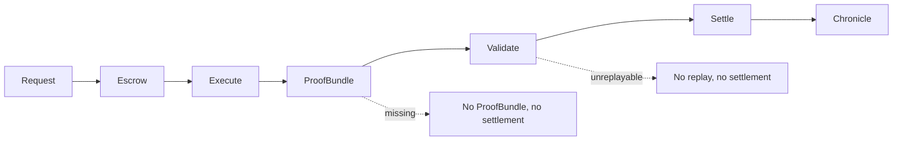
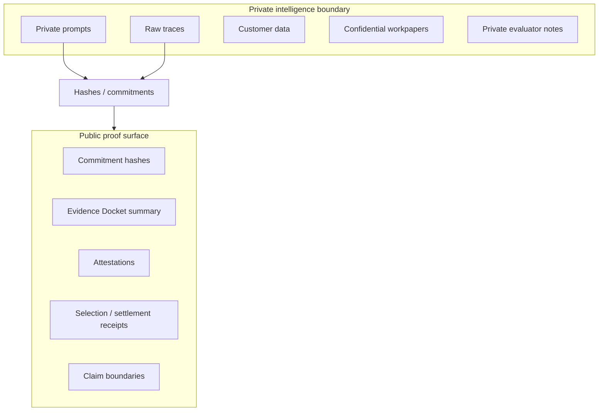
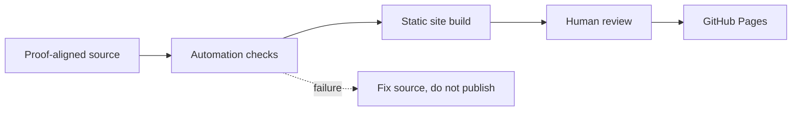
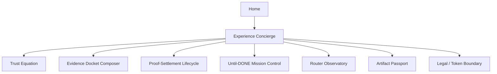
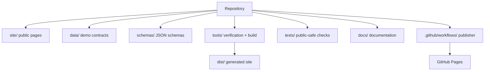

# GoalOS AGIJobManager Ascension

A public-safe, proof-settlement institution for AGIJobManager: browser-local demos, evidence rooms, settlement lifecycle, claim boundaries, and autonomous GitHub Pages publication.

**Production URL:** https://montrealai.github.io/goalos-agijobmanager-ascension/

[](https://montrealai.github.io/goalos-agijobmanager-ascension/)
[](https://github.com/MontrealAI/goalos-agijobmanager-ascension/actions/workflows/goalos-agijobmanager-ascension-production-url-autopilot.yml)


## Institutional doctrine

- A model can answer. An agent can act. An institution must prove.
- Do not put intelligence on-chain. Put proof of intelligence on-chain.
- No proof, no evolution. No eval, no propagation. No rollback, no release.
- Set the objective. GoalOS runs until proof is done. AI creates output. GoalOS creates proof.
- The deliverable is a **Governed Decision State**, not merely a document.

## 30-second explanation

| Question | Answer |
| --- | --- |
| What is this? | A public, browser-local evidence room for exploring how GoalOS turns objectives into Evidence Dockets, ProofBundles, receipts, and governed decision states. |
| What should I click first? | Start at the [production site](https://montrealai.github.io/goalos-agijobmanager-ascension/) and open **Experience Concierge**. |
| What does it not do? | Public demos do not collect user data, do not connect wallets, do not approve tokens, do not broadcast transactions, and do not activate production authority. |
| Why proof matters? | Proof makes claims replayable, review-ready, rollback-ready, and bounded before action or release. |

## 5-minute path

1. Start at the [production site](https://montrealai.github.io/goalos-agijobmanager-ascension/).
2. Open [`/experience-concierge.html`](https://montrealai.github.io/goalos-agijobmanager-ascension/experience-concierge.html), the best first click.
3. Run [`Trust Equation`](https://montrealai.github.io/goalos-agijobmanager-ascension/trust-equation-simulator.html).
4. Run [`Evidence Docket Composer`](https://montrealai.github.io/goalos-agijobmanager-ascension/evidence-docket-composer.html).
5. Run [`Proof-Settlement Lifecycle`](https://montrealai.github.io/goalos-agijobmanager-ascension/proof-settlement-lifecycle.html).
6. Export a public-safe receipt and review the claim boundary before sharing.

## Advanced developer path

1. Inspect data contracts in [`data/`](data/).
2. Inspect schemas in [`schemas/`](schemas/).
3. Inspect tests in [`tests/`](tests/).
4. Run local verification with `npm run verify` and `npm run test`.
5. Build the static site with `npm run build`.
6. Review the publisher workflow at [`.github/workflows/goalos-agijobmanager-ascension-production-url-autopilot.yml`](.github/workflows/goalos-agijobmanager-ascension-production-url-autopilot.yml).
7. Deploy through GitHub Actions after human review.

## Current route catalog

| Route | Audience | What it demonstrates | Output artifact | Safety boundary |
| --- | --- | --- | --- | --- |
| `/` | Visitors | Home demonstration | Review note / route context | Browser-local, read-only; no wallet, no analytics, no cookies, no user data wanted. |
| `/experience-concierge.html` | Visitors | Experience Concierge demonstration | Review note / route context | Browser-local, read-only; no wallet, no analytics, no cookies, no user data wanted. |
| `/experience-hub.html` | Visitors | Experience Hub demonstration | Review note / route context | Browser-local, read-only; no wallet, no analytics, no cookies, no user data wanted. |
| `/command-center.html` | Reviewers / builders | Command Center demonstration | Review note / route context | Browser-local, read-only; no wallet, no analytics, no cookies, no user data wanted. |
| `/trust-equation-simulator.html` | Reviewers / builders | Trust Equation Simulator demonstration | Public-safe receipt | Browser-local, read-only; no wallet, no analytics, no cookies, no user data wanted. |
| `/evidence-docket-composer.html` | Reviewers / builders | Evidence Docket Composer demonstration | Public-safe receipt | Browser-local, read-only; no wallet, no analytics, no cookies, no user data wanted. |
| `/proof-settlement-lifecycle.html` | Reviewers / builders | Proof Settlement Lifecycle demonstration | Public-safe receipt | Browser-local, read-only; no wallet, no analytics, no cookies, no user data wanted. |
| `/until-done-mission-control.html` | Reviewers / builders | Until Done Mission Control demonstration | Review note / route context | Browser-local, read-only; no wallet, no analytics, no cookies, no user data wanted. |
| `/proof-constitution-simulator.html` | Reviewers / builders | Proof Constitution Simulator demonstration | Review note / route context | Browser-local, read-only; no wallet, no analytics, no cookies, no user data wanted. |
| `/ascension-flight-deck.html` | Reviewers / builders | Ascension Flight Deck demonstration | Review note / route context | Browser-local, read-only; no wallet, no analytics, no cookies, no user data wanted. |
| `/proof-conditioned-router-observatory.html` | Reviewers / builders | Proof Conditioned Router Observatory demonstration | Review note / route context | Browser-local, read-only; no wallet, no analytics, no cookies, no user data wanted. |
| `/proof-carrying-artifact-passport.html` | Reviewers / builders | Proof Carrying Artifact Passport demonstration | Public-safe receipt | Browser-local, read-only; no wallet, no analytics, no cookies, no user data wanted. |
| `/action-graph-handoff.html` | Reviewers / builders | Action Graph Handoff demonstration | Review note / route context | Browser-local, read-only; no wallet, no analytics, no cookies, no user data wanted. |
| `/real-task-benchmark-bridge.html` | Reviewers / builders | Real Task Benchmark Bridge demonstration | Review note / route context | Browser-local, read-only; no wallet, no analytics, no cookies, no user data wanted. |
| `/mandate-epoch-clearinghouse.html` | Reviewers / builders | Mandate Epoch Clearinghouse demonstration | Review note / route context | Browser-local, read-only; no wallet, no analytics, no cookies, no user data wanted. |
| `/proof-backed-upgrade-foundry.html` | Reviewers / builders | Proof Backed Upgrade Foundry demonstration | Review note / route context | Browser-local, read-only; no wallet, no analytics, no cookies, no user data wanted. |
| `/sovereign-experience-stream.html` | Reviewers / builders | Sovereign Experience Stream demonstration | Review note / route context | Browser-local, read-only; no wallet, no analytics, no cookies, no user data wanted. |
| `/replay-falsification-gauntlet.html` | Reviewers / builders | Replay Falsification Gauntlet demonstration | Review note / route context | Browser-local, read-only; no wallet, no analytics, no cookies, no user data wanted. |
| `/claim-boundary-firewall.html` | Reviewers / builders | Claim Boundary Firewall demonstration | Review note / route context | Browser-local, read-only; no wallet, no analytics, no cookies, no user data wanted. |
| `/ascension-inflow-control.html` | Reviewers / builders | Ascension Inflow Control demonstration | Review note / route context | Browser-local, read-only; no wallet, no analytics, no cookies, no user data wanted. |
| `/chronicle-compounding-lab.html` | Reviewers / builders | Chronicle Compounding Lab demonstration | Review note / route context | Browser-local, read-only; no wallet, no analytics, no cookies, no user data wanted. |
| `/proof-gradient-arena.html` | Reviewers / builders | Proof Gradient Arena demonstration | Review note / route context | Browser-local, read-only; no wallet, no analytics, no cookies, no user data wanted. |
| `/proof-to-action-theatre.html` | Reviewers / builders | Proof To Action Theatre demonstration | Review note / route context | Browser-local, read-only; no wallet, no analytics, no cookies, no user data wanted. |
| `/multi-agent-institution.html` | Reviewers / builders | Multi Agent Institution demonstration | Review note / route context | Browser-local, read-only; no wallet, no analytics, no cookies, no user data wanted. |
| `/mission-studio.html` | Reviewers / builders | Mission Studio demonstration | Review note / route context | Browser-local, read-only; no wallet, no analytics, no cookies, no user data wanted. |
| `/proof-cards.html` | Reviewers / builders | Proof Cards demonstration | Review note / route context | Browser-local, read-only; no wallet, no analytics, no cookies, no user data wanted. |
| `/architecture.html` | Reviewers / builders | Architecture demonstration | Review note / route context | Browser-local, read-only; no wallet, no analytics, no cookies, no user data wanted. |
| `/verification.html` | Reviewers / builders | Verification demonstration | Review note / route context | Browser-local, read-only; no wallet, no analytics, no cookies, no user data wanted. |
| `/assurance.html` | Reviewers / builders | Assurance demonstration | Review note / route context | Browser-local, read-only; no wallet, no analytics, no cookies, no user data wanted. |
| `/legal.html` | Reviewers / builders | Legal demonstration | Review note / route context | Browser-local, read-only; no wallet, no analytics, no cookies, no user data wanted. |
| `/privacy.html` | Reviewers / builders | Privacy demonstration | Review note / route context | Browser-local, read-only; no wallet, no analytics, no cookies, no user data wanted. |
| `/terms.html` | Reviewers / builders | Terms demonstration | Review note / route context | Browser-local, read-only; no wallet, no analytics, no cookies, no user data wanted. |
| `/agialpha-token-boundary.html` | Reviewers / builders | Agialpha Token Boundary demonstration | Review note / route context | Browser-local, read-only; no wallet, no analytics, no cookies, no user data wanted. |
| `/operator-console.html` | Expert operators | Operator Console demonstration | Review note / route context | Browser-local, read-only; no wallet, no analytics, no cookies, no user data wanted. |
| `/expert-console.html` | Expert operators | Expert Console demonstration | Review note / route context | Expert-only, deliberately separated; requires human authority for any wallet-capable operation. |
| `/expert-mainnet-console.html` | Expert operators | Expert Mainnet Console demonstration | Review note / route context | Expert-only, deliberately separated; requires human authority for any wallet-capable operation. |

## Canonical identities

Verified from [`data/canonical-identities.json`](data/canonical-identities.json) and [`data/agialpha-token-boundary.json`](data/agialpha-token-boundary.json):

| Identity | Value |
| --- | --- |
| AGIJobManager contract | `0xB3AAeb69b630f0299791679c063d68d6687481d1` |
| AGIALPHA official token address | `0xA61a3B3a130a9c20768EEBF97E21515A6046a1fA` |
| Chain | Ethereum Mainnet |
| Chain id | `1` |

AGIALPHA is referenced only as a canonical identity for a pre-existing decentralized token. The public site does **not** sell, offer, distribute, custody, broker, route, redeem, market-make, price-support, liquidity-support, recommend, or make available AGIALPHA.

## Repository architecture

```text
.github/workflows/  GitHub Actions publisher and Pages deployment
site/               public static pages and browser-local demos
data/               demo contracts, catalogs, boundaries, and identities
schemas/            JSON schemas for proof and demo artifacts
docs/               runbooks, onboarding, catalogs, and boundaries
tools/              dependency-free verification and build tools
tests/              dependency-free public-safe and documentation tests
dist/               generated static site artifact
package.json        scripts for verification, docs checks, and builds
```

## Flowcharts















## Local verification commands

```bash
node --version
npm run docs:check
npm run test:docs
npm run verify
npm run test
npm run build
```

## GitHub Web UI deployment

1. Open `https://github.com/MontrealAI/goalos-agijobmanager-ascension`.
2. Upload changed files or edit files in the browser.
3. Commit to `main` with a clear message.
4. Open **Actions**.
5. Select **GoalOS AGIJobManager Ascension Navigation Source Polish Publisher v41**.
6. Click **Run workflow**.
7. Keep `deploy_pages` set to `true`.
8. Keep `commit_generated_source` set to `true`.
9. Leave live factual checks `false` unless `ETHEREUM_RPC_URL` is configured.
10. Verify https://montrealai.github.io/goalos-agijobmanager-ascension/ after the run completes.

## Boundary and disclaimer

This repository provides public-safe demonstrations, documentation, schemas, and local verification. It does not provide legal, financial, investment, tax, medical, security certification, or audit advice. No user data wanted. No wallet on public demos. No production authority is activated by public pages. Simulations are local demonstrations. Expert console pages, where present, are separated and require deliberate human authority.

## What would prove more?

Stronger empirical claims require real tasks, explicit baselines, ProofBundles, replay logs, validator reports, cost/risk ledgers, delayed outcome checks, and independent reproduction by reviewers outside this repository.

## What would falsify this?

- Baselines beat GoalOS on the target tasks.
- Evidence Dockets are unreplayable.
- Proof gates are gameable.
- Rollback fails.
- The public/private proof boundary breaks.
- Coordination overhead dominates verified value.
- Safety or claim boundaries fail.

## Documentation

Start with [`docs/README.md`](docs/README.md), then read [`docs/GETTING_STARTED.md`](docs/GETTING_STARTED.md), [`docs/ARCHITECTURE.md`](docs/ARCHITECTURE.md), and [`docs/DEMO_CATALOG.md`](docs/DEMO_CATALOG.md).
