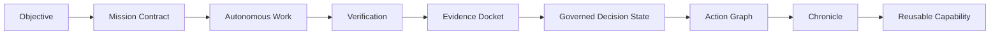
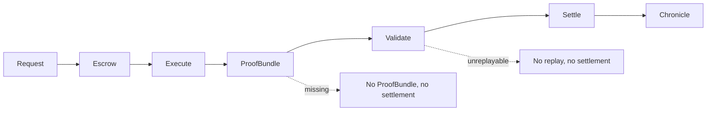
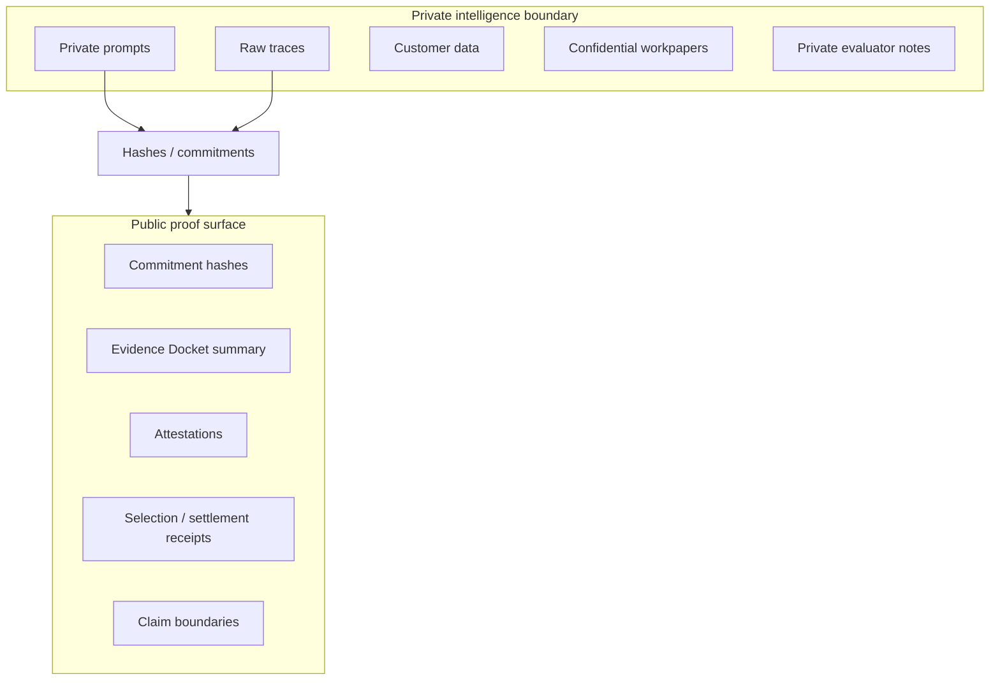
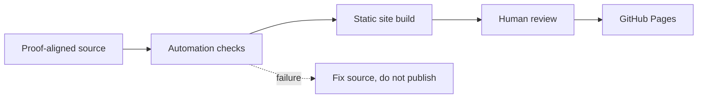

# GoalOS AGIJobManager Ascension

A public-safe proof-settlement institution for AGIJobManager: browser-local demos, Evidence Dockets, settlement lifecycle, claim boundaries, documentation, and autonomous GitHub Pages publication.

Production URL: https://montrealai.github.io/goalos-agijobmanager-ascension/

[](https://montrealai.github.io/goalos-agijobmanager-ascension/)
[](https://github.com/MontrealAI/goalos-agijobmanager-ascension/actions/workflows/goalos-agijobmanager-ascension-production-url-autopilot.yml)


## 30-second explanation

This repository publishes the public website and implementation scaffold for GoalOS AGIJobManager Ascension. It has **50 canonical public routes** in the v43 baseline manifest and **55 canonical public routes** in the current v50 manifest. Start with [Experience Concierge](site/experience-concierge.html) if you are new, or [Command Center](site/command-center.html) if you want the full map.

The core idea is simple: AI output is not institutional work until it is bounded, replayable, validated, and packaged as an Evidence Docket, ProofBundle, SettlementReceipt, Chronicle entry, or Governed Decision State. Public demos run in the browser and demonstrate proof logic with public-safe sample data.

Public demos are no wallet surfaces: they never connect wallets, approve tokens, switch networks, broadcast transactions, move funds, collect user data, grant production authority, add analytics, set cookies, or use browser storage.

## Best first clicks

| User intent | Best first click | Why |
|---|---|---|
| I am new | [Experience Concierge](site/experience-concierge.html) | Guided path through the site |
| I want the full map | [Command Center](site/command-center.html) | Complete route catalog |
| I want the core proof law | [Trust Equation Simulator](site/trust-equation-simulator.html) | Shows why proof turns output into institutional work |
| I want to build a proof room | [Evidence Docket Composer](site/evidence-docket-composer.html) | Creates a claim-bound Evidence Docket receipt |
| I want settlement logic | [Proof-Settlement Lifecycle](site/proof-settlement-lifecycle.html) | Shows request -> proof -> validation -> settlement -> Chronicle |
| I want architecture | [Architecture](site/architecture.html) | Explains source, pages, data, schemas, tests, and publisher |
| I want boundaries | [Legal](site/legal.html) / [Privacy](site/privacy.html) / [AGIALPHA Boundary](site/agialpha-token-boundary.html) | Explains public-safe, data-zero, and token boundaries |

## Core doctrine

A model can answer. An agent can act. An institution must prove.

No Evidence Docket, no strong public claim. No ProofBundle, no settlement. No replay, no settlement. No authority, no autonomy. Public pages are public-safe, browser-local demonstrations unless explicitly marked otherwise. Expert-only pages remain separated from public-safe demos.

## What this repository contains

- Static public website in `site/`.
- Browser-local public demos, Evidence Docket demos, and proof-settlement lifecycle demos.
- Canonical route manifest in `data/canonical-route-manifest-v43.json`.
- Data contracts in `data/` and JSON schemas in `schemas/`.
- Dependency-free tests and verification tools in `tests/` and `tools/`.
- Autonomous GitHub Pages publisher in `.github/workflows/goalos-agijobmanager-ascension-production-url-autopilot.yml`.
- Legal, privacy, regulatory, third-party responsibility, and AGIALPHA boundary pages.
- Expert-only surfaces, when present, separated from public-safe routes.

## What this repository does not do

- No public wallet connection; no wallet is requested by public demos.
- No public token approval.
- No public network switching.
- No public transaction broadcast.
- No funds moved by public demos.
- No user data wanted.
- No analytics.
- No cookies.
- No browser storage.
- No external audit claim.
- No legal, financial, investment, tax, medical, safety-certification, or professional advice.
- No achieved AGI, achieved ASI, empirical SOTA, production certified, or safe autonomy proven claim.
- No production authority from public pages.

## AGIALPHA identity and token boundary

Repository source identifies AGIALPHA on Ethereum Mainnet as `0xA61a3B3a130a9c20768EEBF97E21515A6046a1fA`, AGIJobManager as `0xB3AAeb69b630f0299791679c063d68d6687481d1`, and Ethereum Mainnet chain id as `1`. AGIALPHA is pre-existing and decentralized. This website/repository uses the token address as an identity/reference boundary where relevant. It does not sell, offer, distribute, custody, broker, route, redeem, market-make, price-support, liquidity-support, recommend, or make available AGIALPHA. Users/operators are solely responsible for third-party market, wallet, RPC, tax, sanctions, securities, privacy, and jurisdictional decisions. Public demos do not connect wallets, approve AGIALPHA, switch networks, or broadcast Mainnet transactions.

## Canonical route catalog

See [docs/DEMO_CATALOG.md](docs/DEMO_CATALOG.md) for the full human-readable catalog.

| Route | Audience | What it demonstrates | Output artifact | Boundary |
|---|---|---|---|---|
| [`/action-graph-handoff.html`](site/action-graph-handoff.html) | Operators | Turns governed decisions into scoped action graphs with handoff and rollback boundaries. | ActionGraphReceipt | Review-only; no external action. |
| [`/agialpha-token-boundary.html`](site/agialpha-token-boundary.html) | Token / market reviewers | States AGIALPHA is not available from the site and is not sold, offered, custodied, brokered, routed, redeemed, market-made, or recommended. | Token boundary statement | No token offer. |
| [`/architecture.html`](site/architecture.html) | Developers / reviewers | Explains separation of proof, presentation, execution, public pages, schemas, and expert surfaces. | Architecture map | Static reference. |
| [`/ascension-flight-deck.html`](site/ascension-flight-deck.html) | All users | Guided launcher for the strongest proof paths, with audience filters and same-origin preview. | JourneyReceipt | Browser-local route launcher. |
| [`/ascension-inflow-control.html`](site/ascension-inflow-control.html) | System designers | Shows why compute, tasks, data, incentives, feedback, governance, and tools need regulated inflow. | InflowReceipt | Local simulation. |
| [`/assurance.html`](site/assurance.html) | Risk reviewers | Assurance posture, automation checks, and public-safe invariants. | Assurance summary | Internal assurance only. |
| [`/chronicle-compounding-lab.html`](site/chronicle-compounding-lab.html) | Capability builders | Demonstrates accepted proof entering Chronicle and becoming reusable capability. | ChronicleReceipt | Local simulation. |
| [`/claim-boundary-firewall.html`](site/claim-boundary-firewall.html) | Legal / comms reviewers | Blocks overclaims and separates architecture claims from empirical claims. | BoundaryReceipt | Claim-boundary review only. |
| [`/command-center.html`](site/command-center.html) | Reviewers / operators | Complete searchable catalog of public routes and proof surfaces. | NavigationReceipt | Browser-local catalog. |
| [`/coordination-engine.html`](site/coordination-engine.html) | Advanced builders | Explains the proof-gated coordination engine behind multi-agent institutional work. | Architecture brief | Static reference. |
| [`/coordination-lab.html`](site/coordination-lab.html) | AI system builders | Compares swarm, fixed crew, and institution coordination under proof gates. | Evidence Docket JSON | Browser-local simulation. |
| [`/demo-lab.html`](site/demo-lab.html) | Explorers | Legacy demo entry surface retained for preservation. | Route summary | Public-safe legacy surface. |
| [`/docs.html`](site/docs.html) | Developers / reviewers | Documentation landing page for architecture, runbooks, and boundaries. | Documentation index | Repository docs only; no user data. |
| [`/evidence-docket-composer.html`](site/evidence-docket-composer.html) | Reviewers | Turns a claim into a public/private evidence room with replay and risk gates. | Evidence Docket receipt | Public-safe sample claim only. |
| [`/evidence-docket-court.html`](site/evidence-docket-court.html) | Reviewers | Courtroom metaphor for evaluating claims against evidence, risk, and replay. | Docket review | Public-safe review surface. |
| [`/experience-atlas.html`](site/experience-atlas.html) | Reviewers | Advanced journey map for demos, proof rooms, and boundary pages. | JourneyReceipt | Browser-local catalog. |
| [`/experience-concierge.html`](site/experience-concierge.html) | New visitors | Guides each visitor to the right proof path by intent. | JourneyReceipt | Browser-local route guidance. |
| [`/experience-hub.html`](site/experience-hub.html) | All users | Role-based journeys for proof, settlement, architecture, and boundaries. | JourneyReceipt | Browser-local route guidance. |
| [`/expert-console.html`](site/expert-console.html) | Expert operators | Separated expert surface with explicit human authority boundaries. | Expert console state | Expert-only; no public-safe guarantee. |
| [`/expert-mainnet-console.html`](site/expert-mainnet-console.html) | Expert operators | Separated Mainnet operations chamber requiring deliberate human wallet authority if used. | Expert Mainnet state | Expert-only; human authority required. |
| [`/`](site/index.html) | Everyone | Public front door for identity, proof posture, boundaries, and best first clicks. | Route summary | Public-safe, read-only. |
| [`/loop-to-rsi.html`](site/loop-to-rsi.html) | Advanced builders / reviewers | Shows how long-running loops become deterministic RSI governance with ECI, baselines, Move-37 dossier, and mechanical authority gates. | RSIDossier | Browser-local simulation; no production authority. |
| [`/legal.html`](site/legal.html) | Legal / risk reviewers | Plain-language legal and data-zero boundary. | Boundary statement | No legal advice. |
| [`/mandate-epoch-clearinghouse.html`](site/mandate-epoch-clearinghouse.html) | Advanced operators | Shows how high-volume proof receipts can be batched, quarantined, and cleared without exposing private work. | MandateEpochReceipt | Local simulation. |
| [`/mission-studio.html`](site/mission-studio.html) | Operators | Plain-language mission drafting surface for public-safe mission packages. | Mission draft | No submission; local only. |
| [`/multi-agent-institution.html`](site/multi-agent-institution.html) | AI system builders | Shows why large systems coordinate best as proof-governed institutions, not swarms. | Institution receipt | Local demonstration. |
| [`/navigation-atlas.html`](site/navigation-atlas.html) | Advanced reviewers | Navigation topology and recommended route paths. | NavigationReceipt | Browser-local catalog. |
| [`/operator-console.html`](site/operator-console.html) | Operators | Read-only operator posture for reviewing proof-state surfaces. | Operator summary | Read-only public-safe. |
| [`/privacy.html`](site/privacy.html) | All users | States no user data wanted, no analytics, no cookies, no forms, and no browser storage. | Privacy statement | Data-zero posture. |
| [`/proof-backed-upgrade-foundry.html`](site/proof-backed-upgrade-foundry.html) | Builders | Demonstrates proof-backed upgrade rights: no propagation without proof, eval, rollback, and scope. | UpgradeReceipt | Local simulation. |
| [`/proof-cards.html`](site/proof-cards.html) | Reviewers | Compact cards for proof doctrine, boundaries, and public-safe claims. | Proof card set | Static reference. |
| [`/proof-carrying-artifact-passport.html`](site/proof-carrying-artifact-passport.html) | Capability builders | Shows how accepted proof becomes portable, reusable capability with lineage and rollback metadata. | ArtifactPassport | Local public-safe passport. |
| [`/proof-conditioned-router-observatory.html`](site/proof-conditioned-router-observatory.html) | Advanced builders | Shows proof-conditioned routing: choose the smallest sufficient constellation under cost/risk/proof constraints. | RoutingReceipt | Local routing simulation. |
| [`/proof-constitution-simulator.html`](site/proof-constitution-simulator.html) | Reviewers / governance | Makes Aim -> Act -> Prove -> Evolve visible through protocol objects and gates. | ConstitutionReceipt | Local simulation; no authority. |
| [`/proof-gradient-arena.html`](site/proof-gradient-arena.html) | Governance reviewers | Shows proof, eval, risk, canary, rollback, scope, and challenge gates selecting what may propagate. | SelectionReceipt | Local simulation. |
| [`/proof-settlement-lifecycle.html`](site/proof-settlement-lifecycle.html) | Operators / reviewers | Walks through Request -> Escrow -> Execute -> Proof -> Validate -> Settle -> Chronicle. | SettlementReceipt | Simulated settlement only; no funds. |
| [`/proof-to-action-theatre.html`](site/proof-to-action-theatre.html) | New users | The cleanest objective -> proof -> governed decision state walkthrough. | Proof-to-action receipt | Local demonstration. |
| [`/real-task-benchmark-bridge.html`](site/real-task-benchmark-bridge.html) | Researchers | Maps public-safe demos to real-task benchmark requirements and falsification. | Benchmark Docket | Architecture / benchmark mapping. |
| [`/regulatory-boundary.html`](site/regulatory-boundary.html) | Legal / risk reviewers | Clarifies no investment, financial, legal, or regulated-service posture. | Boundary statement | No regulated-service claim. |
| [`/replay-falsification-gauntlet.html`](site/replay-falsification-gauntlet.html) | Reviewers | Stress-tests proof claims against replay, contradiction, risk, and rollback defects. | FalsificationReceipt | Local simulation. |
| [`/site-atlas.html`](site/site-atlas.html) | Advanced reviewers | Static map of every public route and status group. | Route index | Browser-local catalog. |
| [`/sovereign-experience-stream.html`](site/sovereign-experience-stream.html) | Researchers | Shows how validated work becomes governed experience for future routing and memory. | ExperienceReceipt | Local simulation. |
| [`/sovereign-machine-economy.html`](site/sovereign-machine-economy.html) | Advanced reviewers | Shows integrated Meta-Agentic cognition, Alpha Node runtime, AGI Jobs work OS, and settlement route. | Economy route summary | Public-safe route plus separated expert handoff. |
| [`/start.html`](site/start.html) | New visitors | Clean first-click path from objective to proof demos. | Route summary | Browser-local guidance. |
| [`/terms.html`](site/terms.html) | All users | Use boundaries and disclaimers for public demos. | Terms statement | No professional advice. |
| [`/third-party-responsibility.html`](site/third-party-responsibility.html) | Operators | Places third-party wallet, market, RPC, tax, sanctions, securities, privacy, and jurisdiction responsibility on users/operators. | Boundary statement | Third-party responsibility. |
| [`/loop-operating-room.html`](https://montrealai.github.io/goalos-agijobmanager-ascension/loop-operating-room.html) | All users | Runs a proof-governed agent loop: contract, roles, traces, restarts, evaluator scores, Evidence Docket, Chronicle. | LoopReceipt | Browser-local; no wallet/network/user data. |
| [`/trust-equation-simulator.html`](site/trust-equation-simulator.html) | New users / reviewers | Shows why output becomes institutional work only after proof, validation, settlement, and reuse. | TrustReceipt | Local simulation; no factual certification. |
| [`/until-done-mission-control.html`](site/until-done-mission-control.html) | Operators | Demonstrates run-to-completion: GoalOS stops at proof, not at output. | MissionReceipt | Local state machine. |
| [`/verification.html`](site/verification.html) | Developers / reviewers | Explains verification scripts, build checks, and claim-boundary tests. | Verification summary | No external audit claim. |

## Repository architecture map

```text
.github/workflows/   autonomous publisher workflows
site/                source public pages
data/                public-safe demo data contracts and route manifest
schemas/             JSON schemas
docs/                documentation, reports, runbooks, release notes
tools/               verification, build, route, metadata, and kernel tools
tests/               dependency-free public-safe checks
dist/                generated static site, if committed
package.json         script entry points
```

## Diagrams

### Proof-to-action lifecycle



### Proof-settlement lifecycle



### Public/private proof boundary



### Autonomous website publication pipeline



## Local verification

```bash
node --version
python3 tools/verify.py
node tools/no-registry-preflight.mjs
node tools/pathspec-proof-kernel.mjs
node tools/workflow-reference-auditor.mjs
node tools/docs-link-checker.mjs
node tools/claim-boundary-checker.mjs
node tests/documentation.test.mjs
node tools/run-all-tests.mjs
node tools/apply-public-trust-metadata-v43.mjs
python3 tools/build.py
node tools/run-existing-kernels.mjs
node tools/public-trust-checker-v43.mjs
```

## GitHub Web UI deployment summary

1. If applying an overlay, download and unzip it locally. Upload the overlay contents, not the ZIP file.
2. Commit uploaded contents to `main`.
3. Open GitHub Actions and run **GoalOS AGIJobManager Ascension Repository Public Trust Publisher v43**.
4. Use `deploy_pages = true` and `commit_generated_source = true`.
5. Keep live factual checks false unless `ETHEREUM_RPC_URL` is configured.
6. Verify `dist/production-url.json` and then verify the production pages.
7. Old red workflow logs remain historical; rerun the current publisher after fixing source.

## Claim boundary

### What this claims

This repository claims a public-safe architecture, static website, browser-local demonstration library, route manifest, documentation system, and dependency-free verification scaffold for GoalOS-native AGIJobManager Ascension.

### What this does not claim

It does not claim achieved AGI, achieved ASI, superintelligence, empirical SOTA, external audit completion, production certification, guaranteed ROI, investment returns, legal advice, financial advice, safety certification, autonomous sovereignty, energy abundance, or civilization-scale capability.

### What would prove more

Real tasks, strong baselines, ProofBundles, replay logs, validator reports, cost/risk ledgers, delayed outcomes, independent reproduction, and externally reviewable Evidence Dockets.

### What would falsify this

Baselines beating GoalOS under equal budget, unreplayable Evidence Dockets, gameable proof gates, failed rollback, public/private boundary failure, coordination overhead dominating value, or safety/claim-boundary failure.


### v48 Day-Scale Loop Observatory

- `/day-scale-loop-observatory.html` — browser-local demonstration of long-running agent loops: virtual disk state, restart recovery, readable traces, proof gates, Chronicle candidate, and `LongLoopDocket` export.


### Loop Evidence Reactor

- `/loop-evidence-reactor.html` — browser-local demonstration of long-running agent loops: contract-first state, separated roles, virtual disk, crash/restart, trace reading, harness deletion, bottleneck exposure, and `LoopDocket` export.
- `/loop-to-rsi-sovereign-governance.html` — browser-local demonstration of the transition from agent loops to deterministic RSI governance: ECI, baselines, Move-37, stress tests, dossiers, and mechanical outcome authority.


### From Loop to RSI

- `/loop-to-rsi.html` — browser-local demonstration of the transition from restartable long-running agent loops to deterministic RSI governance: TARGET → EMIT → FILTER → ATLAS → TEST-PLAN → EVAL → INSERT → PROMOTE, Evidence Contact Index, Move-37 dossier, and mechanical authority gates.


### New in v51 — Loop → RSI Control Room

`/loop-to-rsi-control-room.html` is a browser-local control room showing contract-first loops, ECI, baseline gates, Move-37 handling, replay, dossier packaging, Chronicle, and the human review boundary.
