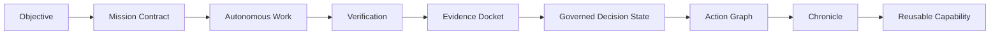
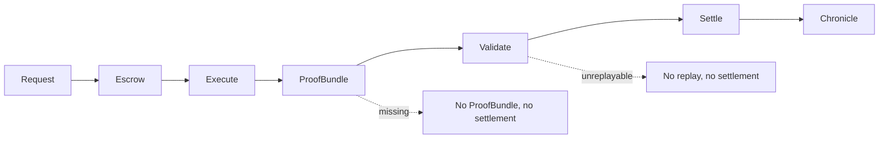
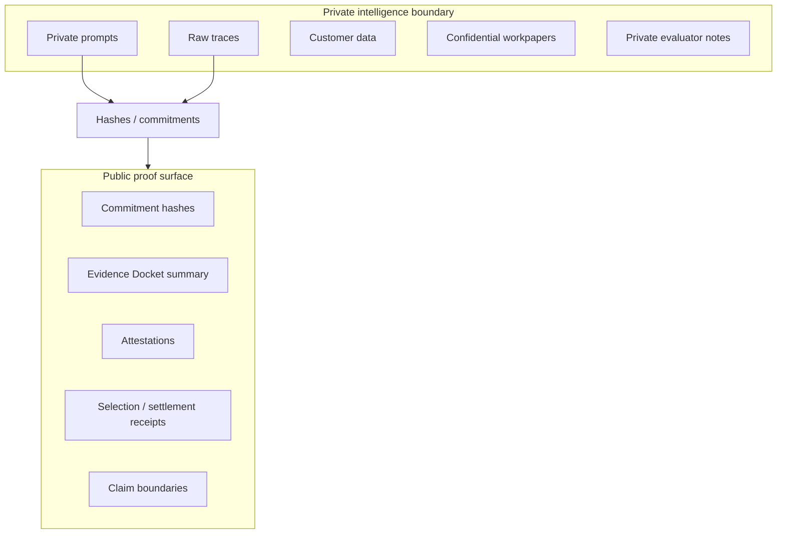
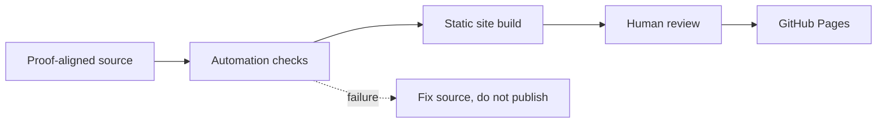

# GoalOS AGIJobManager Ascension

A public-safe proof-settlement institution for AGIJobManager: browser-local demos, Evidence Dockets, settlement lifecycle, claim boundaries, documentation, and autonomous GitHub Pages publication.

**Production URL:** https://montrealai.github.io/goalos-agijobmanager-ascension/

[](https://montrealai.github.io/goalos-agijobmanager-ascension/)
[](https://github.com/MontrealAI/goalos-agijobmanager-ascension/actions/workflows/goalos-agijobmanager-ascension-production-url-autopilot.yml)


## 30-second explanation for non-technical users

This is a public, browser-local evidence room for exploring how GoalOS turns objectives into Evidence Dockets, ProofBundles, receipts, and governed decision states. Click **Experience Concierge** first. Public demos do not collect user data, connect wallets, approve tokens, broadcast transactions, or activate production authority. Proof matters because institutional work should be replayable, review-ready, rollback-ready, and bounded before action.

## Best first clicks

| If you are... | Start here | Why |
| --- | --- | --- |
| I am new | [Experience Concierge](https://montrealai.github.io/goalos-agijobmanager-ascension/experience-concierge.html) | Guided first path through public-safe demos. |
| I want the full map | [Command Center](https://montrealai.github.io/goalos-agijobmanager-ascension/command-center.html) | Route and capability overview. |
| I want the proof equation | [Trust Equation Simulator](https://montrealai.github.io/goalos-agijobmanager-ascension/trust-equation-simulator.html) | Shows how proof confidence is bounded. |
| I want to build a proof room | [Evidence Docket Composer](https://montrealai.github.io/goalos-agijobmanager-ascension/evidence-docket-composer.html) | Composes a public-safe Evidence Docket. |
| I want settlement logic | [Proof-Settlement Lifecycle](https://montrealai.github.io/goalos-agijobmanager-ascension/proof-settlement-lifecycle.html) | Request → escrow → execute → proof → validate → settle. |
| I want architecture | [Architecture](https://montrealai.github.io/goalos-agijobmanager-ascension/architecture.html) | Static site, schemas, tests, and publisher. |
| I want boundaries | [Legal](https://montrealai.github.io/goalos-agijobmanager-ascension/legal.html) / [Privacy](https://montrealai.github.io/goalos-agijobmanager-ascension/privacy.html) / [AGIALPHA Boundary](https://montrealai.github.io/goalos-agijobmanager-ascension/agialpha-token-boundary.html) | Claim, data, and token boundaries. |

## The core idea

GoalOS turns autonomous AI work into proof-bearing institutional work. A model can answer; an agent can act; an institution must prove.

## What this repository contains

- Browser-local public demos and a static public website.
- Data contracts in [`data/`](data/) and JSON schemas in [`schemas/`](schemas/).
- Dependency-free tests in [`tests/`](tests/) and build / verification tooling in [`tools/`](tools/).
- Autonomous GitHub Pages publisher in [`.github/workflows/`](.github/workflows/).
- Claim-boundary, legal, privacy, and AGIALPHA-token-boundary documents.
- Expert-only surfaces, where present, separated from public visitor paths.

## What this repository does not do

No wallet connection on public demos. No token approval. No network switching. No transaction broadcasting. No funds moved. No user data wanted. No analytics. No cookies. No external audit claim. No legal, financial, or investment advice. No achieved AGI/ASI claim. No production authority.

## Route catalog

| Route | Audience | What it demonstrates | Output artifact | Boundary |
| --- | --- | --- | --- | --- |
| `/` | New visitors | Home demonstration | Review note / route context | Browser-local, public-safe, read-only; no wallet, no analytics, no cookies, no user data wanted. |
| `/experience-concierge.html` | New visitors | Experience Concierge demonstration | Review note / route context | Browser-local, public-safe, read-only; no wallet, no analytics, no cookies, no user data wanted. |
| `/experience-hub.html` | New visitors | Experience Hub demonstration | Review note / route context | Browser-local, public-safe, read-only; no wallet, no analytics, no cookies, no user data wanted. |
| `/command-center.html` | Builders / reviewers | Command Center demonstration | Review note / route context | Browser-local, public-safe, read-only; no wallet, no analytics, no cookies, no user data wanted. |
| `/experience-atlas.html` | Builders / reviewers | Experience Atlas demonstration | Review note / route context | Browser-local, public-safe, read-only; no wallet, no analytics, no cookies, no user data wanted. |
| `/site-atlas.html` | Builders / reviewers | Site Atlas demonstration | Review note / route context | Browser-local, public-safe, read-only; no wallet, no analytics, no cookies, no user data wanted. |
| `/navigation-atlas.html` | Builders / reviewers | Navigation Atlas demonstration | Review note / route context | Browser-local, public-safe, read-only; no wallet, no analytics, no cookies, no user data wanted. |
| `/trust-equation-simulator.html` | Builders / reviewers | Trust Equation Simulator demonstration | Public-safe receipt / docket summary | Browser-local, public-safe, read-only; no wallet, no analytics, no cookies, no user data wanted. |
| `/evidence-docket-composer.html` | Builders / reviewers | Evidence Docket Composer demonstration | Public-safe receipt / docket summary | Browser-local, public-safe, read-only; no wallet, no analytics, no cookies, no user data wanted. |
| `/proof-settlement-lifecycle.html` | Builders / reviewers | Proof Settlement Lifecycle demonstration | Public-safe receipt / docket summary | Browser-local, public-safe, read-only; no wallet, no analytics, no cookies, no user data wanted. |
| `/until-done-mission-control.html` | Builders / reviewers | Until Done Mission Control demonstration | Review note / route context | Browser-local, public-safe, read-only; no wallet, no analytics, no cookies, no user data wanted. |
| `/proof-constitution-simulator.html` | Builders / reviewers | Proof Constitution Simulator demonstration | Review note / route context | Browser-local, public-safe, read-only; no wallet, no analytics, no cookies, no user data wanted. |
| `/ascension-flight-deck.html` | Builders / reviewers | Ascension Flight Deck demonstration | Review note / route context | Browser-local, public-safe, read-only; no wallet, no analytics, no cookies, no user data wanted. |
| `/proof-conditioned-router-observatory.html` | Builders / reviewers | Proof Conditioned Router Observatory demonstration | Review note / route context | Browser-local, public-safe, read-only; no wallet, no analytics, no cookies, no user data wanted. |
| `/proof-carrying-artifact-passport.html` | Builders / reviewers | Proof Carrying Artifact Passport demonstration | Public-safe receipt / docket summary | Browser-local, public-safe, read-only; no wallet, no analytics, no cookies, no user data wanted. |
| `/action-graph-handoff.html` | Builders / reviewers | Action Graph Handoff demonstration | Review note / route context | Browser-local, public-safe, read-only; no wallet, no analytics, no cookies, no user data wanted. |
| `/real-task-benchmark-bridge.html` | Builders / reviewers | Real Task Benchmark Bridge demonstration | Review note / route context | Browser-local, public-safe, read-only; no wallet, no analytics, no cookies, no user data wanted. |
| `/mandate-epoch-clearinghouse.html` | Builders / reviewers | Mandate Epoch Clearinghouse demonstration | Review note / route context | Browser-local, public-safe, read-only; no wallet, no analytics, no cookies, no user data wanted. |
| `/proof-backed-upgrade-foundry.html` | Builders / reviewers | Proof Backed Upgrade Foundry demonstration | Review note / route context | Browser-local, public-safe, read-only; no wallet, no analytics, no cookies, no user data wanted. |
| `/sovereign-experience-stream.html` | Builders / reviewers | Sovereign Experience Stream demonstration | Review note / route context | Browser-local, public-safe, read-only; no wallet, no analytics, no cookies, no user data wanted. |
| `/replay-falsification-gauntlet.html` | Builders / reviewers | Replay Falsification Gauntlet demonstration | Review note / route context | Browser-local, public-safe, read-only; no wallet, no analytics, no cookies, no user data wanted. |
| `/claim-boundary-firewall.html` | Review / risk / legal | Claim Boundary Firewall demonstration | Boundary note | Browser-local, public-safe, read-only; no wallet, no analytics, no cookies, no user data wanted. |
| `/ascension-inflow-control.html` | Builders / reviewers | Ascension Inflow Control demonstration | Review note / route context | Browser-local, public-safe, read-only; no wallet, no analytics, no cookies, no user data wanted. |
| `/chronicle-compounding-lab.html` | Builders / reviewers | Chronicle Compounding Lab demonstration | Review note / route context | Browser-local, public-safe, read-only; no wallet, no analytics, no cookies, no user data wanted. |
| `/proof-gradient-arena.html` | Builders / reviewers | Proof Gradient Arena demonstration | Review note / route context | Browser-local, public-safe, read-only; no wallet, no analytics, no cookies, no user data wanted. |
| `/proof-to-action-theatre.html` | Builders / reviewers | Proof To Action Theatre demonstration | Review note / route context | Browser-local, public-safe, read-only; no wallet, no analytics, no cookies, no user data wanted. |
| `/multi-agent-institution.html` | Builders / reviewers | Multi Agent Institution demonstration | Review note / route context | Browser-local, public-safe, read-only; no wallet, no analytics, no cookies, no user data wanted. |
| `/mission-studio.html` | Builders / reviewers | Mission Studio demonstration | Review note / route context | Browser-local, public-safe, read-only; no wallet, no analytics, no cookies, no user data wanted. |
| `/proof-cards.html` | Builders / reviewers | Proof Cards demonstration | Review note / route context | Browser-local, public-safe, read-only; no wallet, no analytics, no cookies, no user data wanted. |
| `/architecture.html` | Builders / reviewers | Architecture demonstration | Review note / route context | Browser-local, public-safe, read-only; no wallet, no analytics, no cookies, no user data wanted. |
| `/verification.html` | Review / risk / legal | Verification demonstration | Review note / route context | Browser-local, public-safe, read-only; no wallet, no analytics, no cookies, no user data wanted. |
| `/assurance.html` | Review / risk / legal | Assurance demonstration | Review note / route context | Browser-local, public-safe, read-only; no wallet, no analytics, no cookies, no user data wanted. |
| `/legal.html` | Review / risk / legal | Legal demonstration | Boundary note | Browser-local, public-safe, read-only; no wallet, no analytics, no cookies, no user data wanted. |
| `/privacy.html` | Review / risk / legal | Privacy demonstration | Boundary note | Browser-local, public-safe, read-only; no wallet, no analytics, no cookies, no user data wanted. |
| `/terms.html` | Review / risk / legal | Terms demonstration | Boundary note | Browser-local, public-safe, read-only; no wallet, no analytics, no cookies, no user data wanted. |
| `/regulatory-boundary.html` | Review / risk / legal | Regulatory Boundary demonstration | Boundary note | Browser-local, public-safe, read-only; no wallet, no analytics, no cookies, no user data wanted. |
| `/third-party-responsibility.html` | Builders / reviewers | Third Party Responsibility demonstration | Boundary note | Browser-local, public-safe, read-only; no wallet, no analytics, no cookies, no user data wanted. |
| `/agialpha-token-boundary.html` | Review / risk / legal | Agialpha Token Boundary demonstration | Boundary note | Browser-local, public-safe, read-only; no wallet, no analytics, no cookies, no user data wanted. |
| `/operator-console.html` | Expert operators | Operator Console demonstration | Review note / route context | Browser-local, public-safe, read-only; no wallet, no analytics, no cookies, no user data wanted. |
| `/expert-console.html` | Expert operators | Expert Console demonstration | Review note / route context | Expert-only surface; separated from public demos; human authority required. |
| `/expert-mainnet-console.html` | Expert operators | Expert Mainnet Console demonstration | Review note / route context | Expert-only surface; separated from public demos; human authority required. |
| `/sovereign-machine-economy.html` | Builders / reviewers | Sovereign Machine Economy demonstration | Review note / route context | Browser-local, public-safe, read-only; no wallet, no analytics, no cookies, no user data wanted. |
| `/docs.html` | Builders / reviewers | Docs demonstration | Review note / route context | Browser-local, public-safe, read-only; no wallet, no analytics, no cookies, no user data wanted. |
| `/archive-v36-ascension-chamber.html` | Builders / reviewers | Archive V36 Ascension Chamber demonstration | Review note / route context | Browser-local, public-safe, read-only; no wallet, no analytics, no cookies, no user data wanted. |
| `/archive-v37-pre-navigation-final.html` | Builders / reviewers | Archive V37 Pre Navigation Final demonstration | Review note / route context | Browser-local, public-safe, read-only; no wallet, no analytics, no cookies, no user data wanted. |
| `/coordination-engine.html` | Builders / reviewers | Coordination Engine demonstration | Review note / route context | Browser-local, public-safe, read-only; no wallet, no analytics, no cookies, no user data wanted. |
| `/coordination-lab.html` | Builders / reviewers | Coordination Lab demonstration | Review note / route context | Browser-local, public-safe, read-only; no wallet, no analytics, no cookies, no user data wanted. |
| `/demo-lab.html` | Builders / reviewers | Demo Lab demonstration | Review note / route context | Browser-local, public-safe, read-only; no wallet, no analytics, no cookies, no user data wanted. |
| `/evidence-docket-court.html` | Builders / reviewers | Evidence Docket Court demonstration | Public-safe receipt / docket summary | Browser-local, public-safe, read-only; no wallet, no analytics, no cookies, no user data wanted. |
| `/start.html` | Builders / reviewers | Start demonstration | Review note / route context | Browser-local, public-safe, read-only; no wallet, no analytics, no cookies, no user data wanted. |

## Canonical identities

Verified from [`data/canonical-identities.json`](data/canonical-identities.json) and [`data/agialpha-token-boundary.json`](data/agialpha-token-boundary.json): AGIJobManager `0xB3AAeb69b630f0299791679c063d68d6687481d1`, official AGIALPHA `0xA61a3B3a130a9c20768EEBF97E21515A6046a1fA`, Ethereum Mainnet chain id `1`. AGIALPHA is a pre-existing decentralized token identity reference only; it is not available from MontrealAI or from this website.

## Repository architecture

```text
.github/workflows/   autonomous publisher
site/                source public pages
data/                public-safe demo data contracts
schemas/             JSON schemas
docs/                documentation and runbooks
tools/               verification, build, route, and kernel tools
tests/               dependency-free public-safe checks
dist/                generated static site, if committed
package.json         script entry points
```

## Canonical lifecycle diagrams

### Diagram A — Proof-to-action



### Diagram B — Proof-settlement



### Diagram C — Public/private proof boundary



### Diagram D — Publication pipeline



## Local verification

```bash
node --version
python3 tools/verify.py
node tools/no-registry-preflight.mjs
node tools/pathspec-proof-kernel.mjs
node tools/workflow-reference-auditor.mjs
node tools/docs-link-checker.mjs
node tests/documentation.test.mjs
node tools/run-all-tests.mjs
python3 tools/build.py
node tools/run-existing-kernels.mjs
```

## GitHub Web UI deployment for non-technical users

1. Download or prepare changed overlay files locally.
2. Upload the overlay **contents**, not the ZIP file itself.
3. Commit directly to `main` with a clear message.
4. Open **Actions** and run **GoalOS AGIJobManager Ascension Navigation Source Polish Publisher v41**.
5. Set `deploy_pages = true` and `commit_generated_source = true`.
6. Keep live factual checks `false` unless `ETHEREUM_RPC_URL` is configured.
7. Verify `production-url.json` and the production pages after the run completes.
8. Old red workflow logs are historical records and cannot be edited; fix source and rerun.

## Claim boundary

### What this claims

This repository claims to provide public-safe static demonstrations, proof-object schemas, data contracts, documentation, tests, and an automated publisher for the AGIJobManager Ascension public site.

### What this does not claim

It does not claim achieved AGI, achieved ASI, empirical SOTA, external audit completion, production certification, safety certification, guaranteed ROI, legal advice, financial advice, investment opportunity, token availability, or production authority.

### What would prove more

Real tasks, a baseline ladder, ProofBundles, replay logs, validator reports, cost/risk ledgers, delayed outcomes, and independent reproduction.

### What would falsify this

Baselines beat GoalOS under equal budget; Evidence Dockets are unreplayable; proof gates are gameable; the public/private boundary fails; rollback fails; coordination overhead dominates value; or safety / claim boundaries fail.

## Documentation

Start with [`docs/README.md`](docs/README.md), then read [`docs/GETTING_STARTED.md`](docs/GETTING_STARTED.md), [`docs/ARCHITECTURE.md`](docs/ARCHITECTURE.md), and [`docs/DEMO_CATALOG.md`](docs/DEMO_CATALOG.md).
