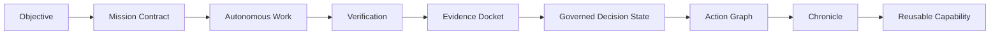
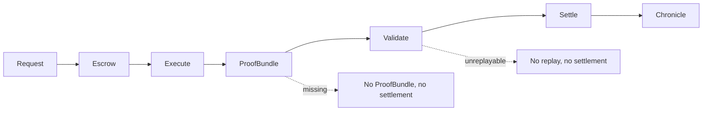
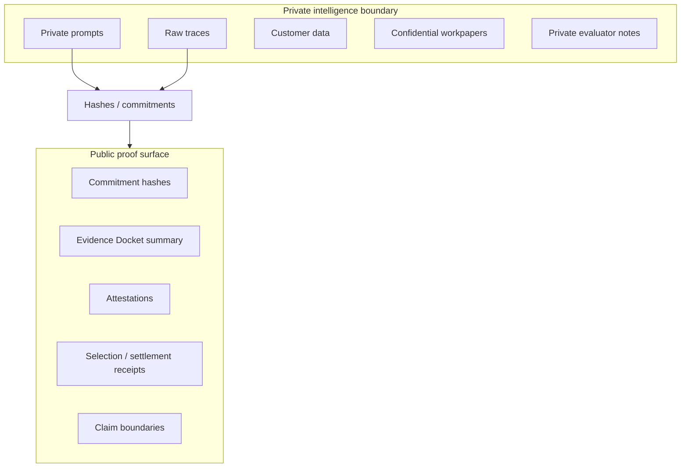
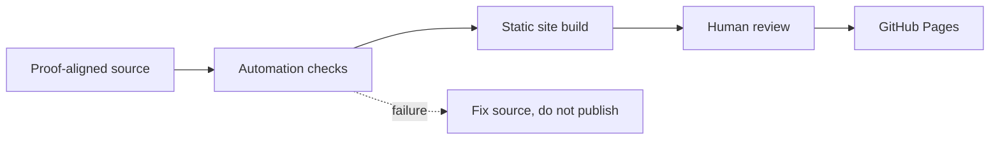
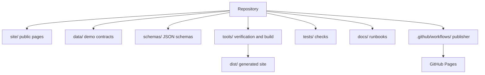

# GoalOS AGIJobManager Ascension

A public-safe proof-settlement institution for AGIJobManager: browser-local demos, Evidence Dockets, settlement lifecycle, claim boundaries, documentation, and autonomous GitHub Pages publication.

Production URL: https://montrealai.github.io/goalos-agijobmanager-ascension/

[](https://montrealai.github.io/goalos-agijobmanager-ascension/)
[](https://github.com/MontrealAI/goalos-agijobmanager-ascension/actions/workflows/goalos-agijobmanager-ascension-production-url-autopilot.yml)


## 30-second explanation

This repository publishes a static public website for understanding GoalOS-style proof-settlement. Start with [Experience Concierge](site/experience-concierge.html) if you are new, or [Command Center](site/command-center.html) if you want the full map. Proof matters because AI output is not institutional work until it is bounded, replayable, validated, and packaged as an Evidence Docket, ProofBundle, SettlementReceipt, Chronicle entry, or Governed Decision State. Public demos run in the browser and demonstrate proof logic with public-safe sample data. Public demos never connect wallets, approve tokens, switch networks, broadcast transactions, move funds, collect user data, grant production authority, add analytics, or set cookies.

## Best first clicks

| User intent | Best first click | Why |
|---|---|---|
| I am new | [Experience Concierge](site/experience-concierge.html) | Guided path through the site |
| I want the full map | [Command Center](site/command-center.html) | Complete route catalog |
| I want the core proof law | [Trust Equation Simulator](site/trust-equation-simulator.html) | Shows why proof turns output into institutional work |
| I want to build a proof room | [Evidence Docket Composer](site/evidence-docket-composer.html) | Creates a claim-bound Evidence Docket receipt |
| I want settlement logic | [Proof-Settlement Lifecycle](site/proof-settlement-lifecycle.html) | Shows request -> proof -> validation -> settlement -> Chronicle |
| I want architecture | [Architecture](site/architecture.html) | Explains source, pages, data, schemas, tests, and publisher |
| I want boundaries | [Legal](site/legal.html) / [Privacy](site/privacy.html) / [AGIALPHA Boundary](site/agialpha-token-boundary.html) | Explains public-safe, data-zero, and token boundaries |

## Core idea

GoalOS turns autonomous AI work into proof-bearing institutional work. A model can answer. An agent can act. An institution must prove.

Canonical doctrine: no Evidence Docket, no strong public claim. No ProofBundle, no settlement. No replay, no settlement. No authority, no autonomy. Public pages are public-safe, browser-local demonstrations unless explicitly marked otherwise. Expert-only pages remain visually and textually separated from public-safe demos.

## What this repository contains

- Static public website in `site/`.
- Browser-local public demos, Evidence Docket demos, and proof-settlement lifecycle demos.
- Data contracts in `data/` and JSON schemas in `schemas/`.
- Dependency-free tests and verification tools in `tests/` and `tools/`.
- Autonomous GitHub Pages publisher in `.github/workflows/goalos-agijobmanager-ascension-production-url-autopilot.yml`.
- Legal, privacy, regulatory, third-party responsibility, and AGIALPHA boundary pages.
- Expert-only surfaces, when present, separated from public-safe routes.

## What this repository does not do

- No public wallet connection.
- No public token approval.
- No public network switching.
- No public transaction broadcast.
- No funds moved by public demos.
- No user data wanted.
- No analytics.
- No cookies.
- No external audit claim.
- No legal, financial, investment, tax, medical, safety-certification, or professional advice.
- No achieved AGI, achieved ASI, empirical SOTA, production certified, or safe autonomy proven claim.
- No production authority from public pages.

## AGIALPHA identity and token boundary

Repository source identifies AGIALPHA on Ethereum Mainnet as `0xA61a3B3a130a9c20768EEBF97E21515A6046a1fA`, AGIJobManager as `0xB3AAeb69b630f0299791679c063d68d6687481d1`, and Ethereum Mainnet chain id as `1`. AGIALPHA is pre-existing and decentralized. This website/repository uses the token address as an identity/reference boundary where relevant. It does not sell, offer, distribute, custody, broker, route, redeem, market-make, price-support, liquidity-support, recommend, or make available AGIALPHA. Users/operators are solely responsible for third-party market, wallet, RPC, tax, sanctions, securities, privacy, and jurisdictional decisions. Public demos do not connect wallets, approve AGIALPHA, switch networks, or broadcast Mainnet transactions.

## Route catalog

| Route | Audience | What it demonstrates | Output artifact | Boundary |
|---|---|---|---|---|
| [`/`](site/index.html) | Public / reviewer | Home proof surface | Public-safe receipt or route summary | Public-safe browser-local demo; no wallet, no analytics, no cookies, no user data wanted. |
| [`/experience-concierge.html`](site/experience-concierge.html) | Public / reviewer | Experience Concierge proof surface | Public-safe receipt or route summary | Public-safe browser-local demo; no wallet, no analytics, no cookies, no user data wanted. |
| [`/experience-hub.html`](site/experience-hub.html) | Public / reviewer | Experience Hub proof surface | Public-safe receipt or route summary | Public-safe browser-local demo; no wallet, no analytics, no cookies, no user data wanted. |
| [`/command-center.html`](site/command-center.html) | Public / reviewer | Command Center proof surface | Public-safe receipt or route summary | Public-safe browser-local demo; no wallet, no analytics, no cookies, no user data wanted. |
| [`/experience-atlas.html`](site/experience-atlas.html) | Public / reviewer | Experience Atlas proof surface | Public-safe receipt or route summary | Public-safe browser-local demo; no wallet, no analytics, no cookies, no user data wanted. |
| [`/site-atlas.html`](site/site-atlas.html) | Public / reviewer | Site Atlas proof surface | Public-safe receipt or route summary | Public-safe browser-local demo; no wallet, no analytics, no cookies, no user data wanted. |
| [`/navigation-atlas.html`](site/navigation-atlas.html) | Public / reviewer | Navigation Atlas proof surface | Public-safe receipt or route summary | Public-safe browser-local demo; no wallet, no analytics, no cookies, no user data wanted. |
| [`/start.html`](site/start.html) | Public / reviewer | Start proof surface | Public-safe receipt or route summary | Public-safe browser-local demo; no wallet, no analytics, no cookies, no user data wanted. |
| [`/trust-equation-simulator.html`](site/trust-equation-simulator.html) | Public / reviewer | Trust Equation Simulator proof surface | Public-safe receipt or route summary | Public-safe browser-local demo; no wallet, no analytics, no cookies, no user data wanted. |
| [`/evidence-docket-composer.html`](site/evidence-docket-composer.html) | Public / reviewer | Evidence Docket Composer proof surface | Evidence Docket receipt | Public-safe browser-local demo; no wallet, no analytics, no cookies, no user data wanted. |
| [`/proof-settlement-lifecycle.html`](site/proof-settlement-lifecycle.html) | Public / reviewer | Proof Settlement Lifecycle proof surface | SettlementReceipt / Chronicle trace | Public-safe browser-local demo; no wallet, no analytics, no cookies, no user data wanted. |
| [`/until-done-mission-control.html`](site/until-done-mission-control.html) | Public / reviewer | Until Done Mission Control proof surface | Public-safe receipt or route summary | Public-safe browser-local demo; no wallet, no analytics, no cookies, no user data wanted. |
| [`/proof-constitution-simulator.html`](site/proof-constitution-simulator.html) | Public / reviewer | Proof Constitution Simulator proof surface | Public-safe receipt or route summary | Public-safe browser-local demo; no wallet, no analytics, no cookies, no user data wanted. |
| [`/ascension-flight-deck.html`](site/ascension-flight-deck.html) | Public / reviewer | Ascension Flight Deck proof surface | Public-safe receipt or route summary | Public-safe browser-local demo; no wallet, no analytics, no cookies, no user data wanted. |
| [`/proof-conditioned-router-observatory.html`](site/proof-conditioned-router-observatory.html) | Public / reviewer | Proof Conditioned Router Observatory proof surface | Routing receipt | Public-safe browser-local demo; no wallet, no analytics, no cookies, no user data wanted. |
| [`/proof-carrying-artifact-passport.html`](site/proof-carrying-artifact-passport.html) | Public / reviewer | Proof Carrying Artifact Passport proof surface | Proof-Carrying Artifact Passport | Public-safe browser-local demo; no wallet, no analytics, no cookies, no user data wanted. |
| [`/action-graph-handoff.html`](site/action-graph-handoff.html) | Public / reviewer | Action Graph Handoff proof surface | Public-safe receipt or route summary | Public-safe browser-local demo; no wallet, no analytics, no cookies, no user data wanted. |
| [`/real-task-benchmark-bridge.html`](site/real-task-benchmark-bridge.html) | Public / reviewer | Real Task Benchmark Bridge proof surface | Benchmark Evidence Docket | Public-safe browser-local demo; no wallet, no analytics, no cookies, no user data wanted. |
| [`/mandate-epoch-clearinghouse.html`](site/mandate-epoch-clearinghouse.html) | Public / reviewer | Mandate Epoch Clearinghouse proof surface | Public-safe receipt or route summary | Public-safe browser-local demo; no wallet, no analytics, no cookies, no user data wanted. |
| [`/proof-backed-upgrade-foundry.html`](site/proof-backed-upgrade-foundry.html) | Public / reviewer | Proof Backed Upgrade Foundry proof surface | Public-safe receipt or route summary | Public-safe browser-local demo; no wallet, no analytics, no cookies, no user data wanted. |
| [`/sovereign-experience-stream.html`](site/sovereign-experience-stream.html) | Public / reviewer | Sovereign Experience Stream proof surface | Public-safe receipt or route summary | Public-safe browser-local demo; no wallet, no analytics, no cookies, no user data wanted. |
| [`/replay-falsification-gauntlet.html`](site/replay-falsification-gauntlet.html) | Public / reviewer | Replay Falsification Gauntlet proof surface | Public-safe receipt or route summary | Public-safe browser-local demo; no wallet, no analytics, no cookies, no user data wanted. |
| [`/claim-boundary-firewall.html`](site/claim-boundary-firewall.html) | Public / reviewer | Claim Boundary Firewall proof surface | Boundary text / policy reference | Public-safe browser-local demo; no wallet, no analytics, no cookies, no user data wanted. |
| [`/ascension-inflow-control.html`](site/ascension-inflow-control.html) | Public / reviewer | Ascension Inflow Control proof surface | Public-safe receipt or route summary | Public-safe browser-local demo; no wallet, no analytics, no cookies, no user data wanted. |
| [`/chronicle-compounding-lab.html`](site/chronicle-compounding-lab.html) | Public / reviewer | Chronicle Compounding Lab proof surface | Public-safe receipt or route summary | Public-safe browser-local demo; no wallet, no analytics, no cookies, no user data wanted. |
| [`/proof-gradient-arena.html`](site/proof-gradient-arena.html) | Public / reviewer | Proof Gradient Arena proof surface | Public-safe receipt or route summary | Public-safe browser-local demo; no wallet, no analytics, no cookies, no user data wanted. |
| [`/proof-to-action-theatre.html`](site/proof-to-action-theatre.html) | Public / reviewer | Proof To Action Theatre proof surface | Public-safe receipt or route summary | Public-safe browser-local demo; no wallet, no analytics, no cookies, no user data wanted. |
| [`/multi-agent-institution.html`](site/multi-agent-institution.html) | Public / reviewer | Multi Agent Institution proof surface | Public-safe receipt or route summary | Public-safe browser-local demo; no wallet, no analytics, no cookies, no user data wanted. |
| [`/coordination-lab.html`](site/coordination-lab.html) | Public / reviewer | Coordination Lab proof surface | Public-safe receipt or route summary | Public-safe browser-local demo; no wallet, no analytics, no cookies, no user data wanted. |
| [`/mission-studio.html`](site/mission-studio.html) | Public / reviewer | Mission Studio proof surface | Public-safe receipt or route summary | Public-safe browser-local demo; no wallet, no analytics, no cookies, no user data wanted. |
| [`/proof-cards.html`](site/proof-cards.html) | Public / reviewer | Proof Cards proof surface | Public-safe receipt or route summary | Public-safe browser-local demo; no wallet, no analytics, no cookies, no user data wanted. |
| [`/architecture.html`](site/architecture.html) | Public / reviewer | Architecture proof surface | Public-safe receipt or route summary | Public-safe browser-local demo; no wallet, no analytics, no cookies, no user data wanted. |
| [`/verification.html`](site/verification.html) | Public / reviewer | Verification proof surface | Public-safe receipt or route summary | Public-safe browser-local demo; no wallet, no analytics, no cookies, no user data wanted. |
| [`/assurance.html`](site/assurance.html) | Public / reviewer | Assurance proof surface | Public-safe receipt or route summary | Public-safe browser-local demo; no wallet, no analytics, no cookies, no user data wanted. |
| [`/legal.html`](site/legal.html) | Public / reviewer | Legal proof surface | Boundary text / policy reference | Boundary page; no advice, no custody, no token offer. |
| [`/privacy.html`](site/privacy.html) | Public / reviewer | Privacy proof surface | Boundary text / policy reference | Boundary page; no advice, no custody, no token offer. |
| [`/terms.html`](site/terms.html) | Public / reviewer | Terms proof surface | Boundary text / policy reference | Boundary page; no advice, no custody, no token offer. |
| [`/regulatory-boundary.html`](site/regulatory-boundary.html) | Public / reviewer | Regulatory Boundary proof surface | Boundary text / policy reference | Boundary page; no advice, no custody, no token offer. |
| [`/third-party-responsibility.html`](site/third-party-responsibility.html) | Public / reviewer | Third Party Responsibility proof surface | Public-safe receipt or route summary | Boundary page; no advice, no custody, no token offer. |
| [`/agialpha-token-boundary.html`](site/agialpha-token-boundary.html) | Public / reviewer | Agialpha Token Boundary proof surface | Boundary text / policy reference | Boundary page; no advice, no custody, no token offer. |
| [`/operator-console.html`](site/operator-console.html) | Public / reviewer | Operator Console proof surface | Public-safe receipt or route summary | Public-safe browser-local demo; no wallet, no analytics, no cookies, no user data wanted. |
| [`/expert-console.html`](site/expert-console.html) | Public / reviewer | Expert Console proof surface | Expert-only human-directed console state | Expert-only; separated from public-safe demos; human wallet authority only if used. |
| [`/expert-mainnet-console.html`](site/expert-mainnet-console.html) | Public / reviewer | Expert Mainnet Console proof surface | Expert-only human-directed console state | Expert-only; separated from public-safe demos; human wallet authority only if used. |
| [`/sovereign-machine-economy.html`](site/sovereign-machine-economy.html) | Public / reviewer | Sovereign Machine Economy proof surface | Public-safe receipt or route summary | Public-safe browser-local demo; no wallet, no analytics, no cookies, no user data wanted. |

## Repository architecture map

```text
.github/workflows/   autonomous publisher workflows
site/                source public pages
data/                public-safe demo data contracts
schemas/             JSON schemas
docs/                documentation and runbooks
tools/               verification, build, route, and kernel tools
tests/               dependency-free public-safe checks
dist/                generated static site, if committed
package.json         script entry points
```

## Diagrams

### Proof-to-action lifecycle



### Proof-settlement lifecycle



### Public/private proof boundary



### Autonomous website publication pipeline



### Repository architecture



## Local verification

```bash
node --version
python3 tools/verify.py
node tools/no-registry-preflight.mjs
node tools/pathspec-proof-kernel.mjs
node tools/workflow-reference-auditor.mjs
node tools/docs-link-checker.mjs
node tests/documentation.test.mjs
node tools/run-all-tests.mjs
python3 tools/build.py
node tools/run-existing-kernels.mjs
```

## GitHub Web UI deployment summary

1. If applying an overlay, download and unzip it locally. Upload the overlay contents, not the ZIP file.
2. Commit uploaded contents to `main`.
3. Open GitHub Actions and run **GoalOS AGIJobManager Ascension Institutional Website Publisher v42**.
4. Use `deploy_pages = true` and `commit_generated_source = true`.
5. Keep live factual checks false unless `ETHEREUM_RPC_URL` is configured.
6. Verify `dist/production-url.json` and then verify the production pages.
7. Old red workflow logs remain historical; rerun the current publisher after fixing source.

## Claim boundary

### What this claims

This repository claims to provide a public-safe static proof-settlement demonstration surface, data contracts, schemas, verification tooling, and documentation for GoalOS AGIJobManager Ascension.

### What this does not claim

It does not claim achieved AGI, achieved ASI, empirical SOTA, external audit completed, production certified, safe autonomy proven, guaranteed return, investment opportunity, legal advice, financial advice, tax advice, medical advice, or real-world production authority from public pages.

### What would prove more

Real tasks, baselines, ProofBundles, replay logs, validator reports, cost/risk ledgers, delayed outcomes, and independent reproduction.

### What would falsify this

Baselines beat GoalOS under equal budget; Evidence Dockets are unreplayable; proof gates are gameable; rollback fails; the public/private boundary fails; coordination overhead dominates verified value; or safety and claim boundaries fail.

## Documentation

Start at [docs/README.md](docs/README.md), then continue to [Getting Started](docs/GETTING_STARTED.md), [Architecture](docs/ARCHITECTURE.md), [Demo Catalog](docs/DEMO_CATALOG.md), [Claim Boundary](docs/CLAIM_BOUNDARY.md), and [AGIALPHA Boundary](docs/AGIALPHA_BOUNDARY.md).
