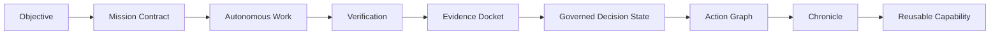
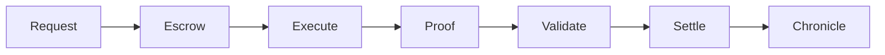
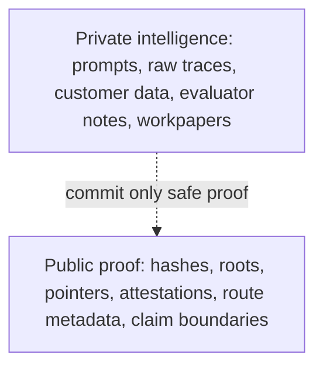
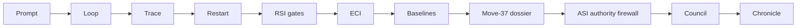
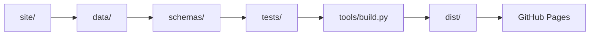
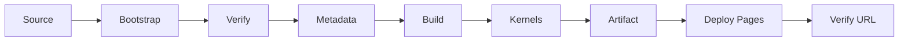
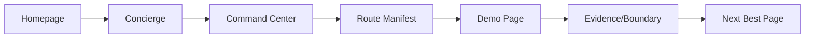

# GoalOS AGIJobManager Ascension

A public-safe proof-settlement institution demo suite for AGIJobManager Ascension: AI creates output; GoalOS creates proof.

Production URL: https://montrealai.github.io/goalos-agijobmanager-ascension/

[](https://montrealai.github.io/goalos-agijobmanager-ascension/)
[](https://github.com/MontrealAI/goalos-agijobmanager-ascension/actions/workflows/goalos-agijobmanager-ascension-production-url-autopilot.yml)


## GoalOS Care Command v66

The primary front door is now `goalos-care-command.html`: a public-safe, browser-local console where a visitor types one plain-language objective and GoalOS prepares the proof path, answers route questions, and emits a local receipt. All existing pages remain available through the Complete Route Index and command layers.

## 30-second explanation

A model can answer. An agent can act. An institution must prove. GoalOS AGIJobManager Ascension is a static GitHub Pages website and repository scaffold showing how autonomous work can be bounded by Mission Contracts, verification, Evidence Dockets, ProofBundles, governed decision states, settlement receipts, Chronicle entries, and human authority.

The canonical route manifest currently contains **70 canonical public routes**, generated from `data/canonical-route-manifest.json`. 
Compatibility lineage: historical v43-compatible tests preserve **70 canonical public routes** while the current v62/v61 canonical manifest lists **70 canonical public routes**. No public wallet connection.

Start with [Canonical Proof Institution](site/canonical-proof-institution.html), [Experience Command](site/experience-command.html), or [Experience Concierge](site/experience-concierge.html) if you are new, [Command Center](site/command-center.html) for the searchable catalog, or [Evidence Docket Composer](site/evidence-docket-composer.html) to inspect proof.

## Best first clicks by visitor role

| Visitor | First click | Why |
|---|---|---|
| Non-technical visitor | [Start](site/start.html) or [Experience Concierge](site/experience-concierge.html) | Plain-language path in two minutes. |
| Reviewer | [Command Center](site/command-center.html) | Search all routes, categories, and boundaries. |
| Developer | [Developer Guide](docs/DEVELOPER_GUIDE.md) | Run, build, test, and add routes safely. |
| Legal / risk / privacy | [Legal](site/legal.html), [Privacy](site/privacy.html), [AGIALPHA Boundary](site/agialpha-token-boundary.html) | No-advice, data-zero, and token boundaries. |
| Advanced governance reader | [Superintelligence Proof Governance Console](site/superintelligence-proof-governance-console.html) | Loop → RSI → ASI-horizon governance corridor. |

## What GoalOS demonstrates

- Objective → Mission Contract → Autonomous Work → Verification → Evidence Docket → Governed Decision State → Action Graph → Chronicle → Reusable Capability.
- Request → Escrow → Execute → Proof → Validate → Settle → Chronicle.
- Proof of intelligence can be committed, reviewed, replayed, challenged, and settled without putting private intelligence on-chain.
- No ProofBundle, no settlement. No proof, no evolution. No eval, no propagation. No rollback, no release.

## Public-safe boundary

Public demos are browser-local demonstrations unless explicitly marked otherwise. no wallet. no user data wanted. They require no account and use no forms, analytics, cookies, public wallet connection, no public wallet, token approval, network switching, transaction broadcast, funds movement, user-data collection, or production authority.

## Canonical identities

| Identity | Value |
|---|---|
| AGIJobManager | `0xB3AAeb69b630f0299791679c063d68d6687481d1` |
| AGIALPHA Ethereum Mainnet token | `0xA61a3B3a130a9c20768EEBF97E21515A6046a1fA` |
| Ethereum Mainnet chain id | `1` |

## What this is / what this is not

**This is:**

- a public-safe proof-settlement institution demo suite;
- a static GitHub Pages website;
- a browser-local evidence/proof demonstration system;
- a documentation and verification scaffold;
- a claim-bounded public front door for AGIJobManager Ascension.

**This is not:**

- a wallet app, token sale, exchange, broker, custody service, or liquidity surface;
- legal, financial, investment, tax, medical, or professional advice;
- an external audit, production certification, or proof that AGI or ASI has been realized;
- a production authorization surface.

## Architecture map

`site/` contains public pages; `data/` contains route catalogs and demo contracts; `schemas/` contains JSON contracts; `tools/` contains build/check runners; `tests/` contains dependency-zero tests; `dist/` is generated by `tools/build.py` for GitHub Pages.















## Public/private proof boundary

Public proof may expose hashes, Merkle roots, pointers, attestations, route metadata, sanitized receipts, and claim boundaries. Private intelligence stays private: prompts, raw traces, customer data, private evaluator notes, workpapers, regulated records, and confidential task data.

## Loop → RSI → ASI governance horizon

ASI and superintelligence language is a governance horizon, not an achieved-capability claim. The advanced corridor is Prompt → Loop → Trace → Restart → RSI gates → ECI → Baselines → Move-37 dossier → ASI authority firewall → Council → Chronicle. Search control is not outcome authority.

## How to run locally

```bash
node --version
npm test
npm run build
```

No npm install is required because the publisher is dependency-zero.

## How to publish through GitHub Actions

Open **Actions → GoalOS AGIJobManager Ascension Repository + Website Institutional Excellence v56 Publisher**. Choose **Run workflow**. Keep `deploy_pages` and `commit_generated_source` enabled for a normal release. Leave live factual checks disabled unless `ETHEREUM_RPC_URL` is configured.

## Repository structure

- `site/` — static public pages and assets.
- `data/` — canonical route manifest, navigation catalogs, public demo contracts.
- `schemas/` — data contract schemas.
- `docs/` — documentation spine and release notes.
- `tools/` — build, verification, dynamic runners, static checkers.
- `tests/` — dependency-zero test entrypoints.
- `.github/workflows/` — Pages publisher.

## Route and demo catalog links

- [Canonical route manifest](data/canonical-route-manifest.json)
- [Demo catalog](docs/DEMO_CATALOG.md)
- [Route manifest policy](docs/ROUTE_MANIFEST_POLICY.md)
- [Release index](docs/RELEASE_INDEX.md)

## Verification and tests

Primary checks are `npm test` and `npm run build`. The scripts use dynamic runners so the workflow does not hard-call missing historical helpers or version-specific test files.

## Contributing

Read [CONTRIBUTING.md](CONTRIBUTING.md). Add routes by updating the page, data contract, schema, canonical manifest/catalog references, docs, and tests while preserving the public-safe and claim-boundary rules.

## Legal/privacy/token boundaries

Read [Legal](site/legal.html), [Privacy](site/privacy.html), [Terms](site/terms.html), [AGIALPHA Boundary](docs/AGIALPHA_BOUNDARY.md), and [Public Safe Boundary](docs/PUBLIC_SAFE_BOUNDARY.md). AGIALPHA is referenced only as an identity/protocol boundary and is not sold, offered, distributed, custodied, brokered, routed, redeemed, market-made, price-supported, liquidity-supported, recommended, or made available by this repository or website.

## Claim boundary and release notes

No Evidence Docket, no strong public claim. Architecture claims are not empirical claims. Empirical claims require real tasks, baselines, ProofBundles, replay logs, validator reports, cost/safety ledgers, delayed outcomes, and independent review. See [Claim Boundary](docs/CLAIM_BOUNDARY.md) and [v56 release notes](docs/releases/V56_REPOSITORY_WEBSITE_INSTITUTIONAL_EXCELLENCE.md).


## v57 complete route recovery

The public website now includes a static-first [Complete Route Index](site/complete-route-index.html) generated from the actual site HTML and the canonical route manifest. It includes preserved archives, nested evidence pages, loop theatres, expert surfaces, legal boundaries, and every current Loop → RSI → ASI horizon console.


## v58 complete experience command

The public website includes [Experience Command](site/experience-command.html), a single command-grade route for every preserved public demo, proof room, loop/RSI console, ASI-horizon boundary, archive, legal boundary, and evidence surface.


## v59 canonical proof institution finalization

The public website now includes [Canonical Proof Institution](site/canonical-proof-institution.html): one final command room for route integrity, proof doctrine, public-safe boundaries, and best user paths. The canonical route manifest now contains **70 canonical public routes** and every source HTML page is represented.


## Ask GoalOS Sovereign Router v62

A browser-local question router is available at [`ask-goalos.html`](https://montrealai.github.io/goalos-agijobmanager-ascension/ask-goalos.html). It answers public-site questions from the canonical route manifest, local doctrine cards, and public-safe page descriptions; it explains the best route, shows alternatives, exports a local routing receipt, and opens a page only when the visitor explicitly asks it to. It uses no account, wallet, analytics, cookies, browser storage, form submission, or network request.


## GoalOS Mission Autopilot v63

`goalos-mission-autopilot.html` is the separate high-level console for users who want to type one objective and let GoalOS assemble the proof mission: Mission Contract, Evidence Docket outline, governed decision state, Action Graph, Chronicle entry, and local receipt.


## GoalOS Command Console v64

The public front door now includes `goalos-command-console.html`: a browser-local command console where visitors type one public-safe objective and receive a Mission Contract, Evidence Docket plan, route handoff, governed decision state, and downloadable receipt.


## v65 GoalOS Take-Care Console

Start here for the simplest user experience: [`goalos-take-care.html`](site/goalos-take-care.html). Type what you want; GoalOS locally prepares a mission, proof plan, route handoff, and `GoalOSTakeCareReceipt`. Canonical route count: **70** public routes.
