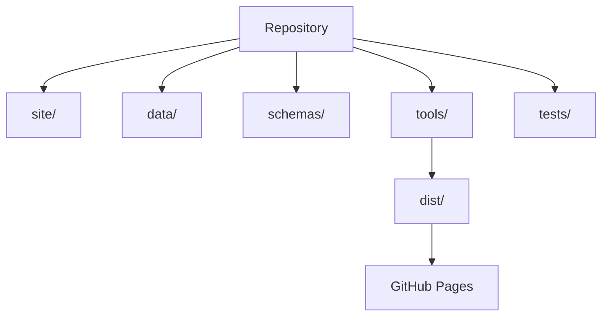
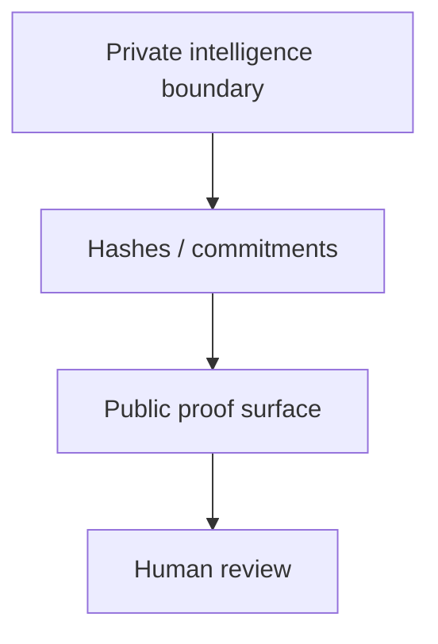

# Architecture

The repository is a dependency-zero static website. Source pages live in `site/`, public-safe contracts in `data/`, schemas in `schemas/`, checks in `tests/`, and build/verification kernels in `tools/`. GitHub Actions builds and publishes `dist/` to GitHub Pages. Expert-only surfaces are separated from public demos.

## Shared boundary

Public demos are browser-local and public-safe: no user data wanted, no forms, no analytics, no cookies, no localStorage/sessionStorage, no public wallet connection, no public token approval, no public network switching, no public transaction broadcast, no funds moved, and no production authority. This material is not legal, financial, investment, tax, medical, audit, safety-certification, or professional advice. It does not claim achieved AGI, achieved ASI, empirical SOTA, external audit completed, production certified, safe autonomy proven, guaranteed return, or investment opportunity.
