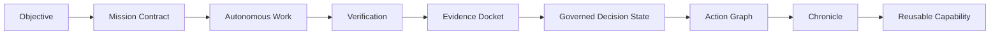
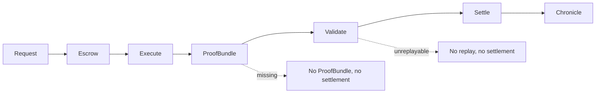
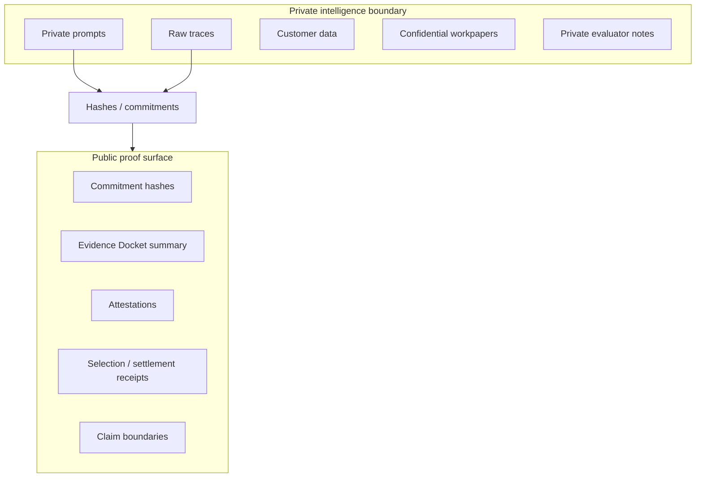
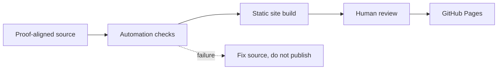
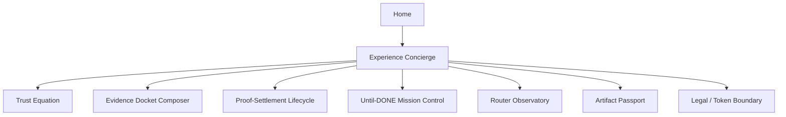
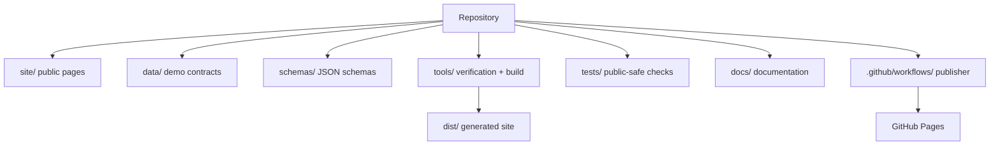

# Architecture

[Docs index](README.md) · [Getting started](GETTING_STARTED.md) · [Architecture](ARCHITECTURE.md) · [Demo catalog](DEMO_CATALOG.md) · [Claim boundary](CLAIM_BOUNDARY.md) · [AGIALPHA boundary](AGIALPHA_BOUNDARY.md)

GoalOS AGIJobManager Ascension is a static, proof-bound public website with browser-local demonstrations, data contracts, schemas, dependency-free tools, tests, and a GitHub Actions publisher.

## System layers

| Layer | Role | Boundary |
| --- | --- | --- |
| Public website | Human-readable institutional front door in `site/` | No user data wanted; no public wallet calls. |
| Browser-local demos | Simulate proof rooms and receipts | Local demonstration only. |
| Data contracts | JSON demo inputs and route catalogs in `data/` | Reviewable source, not private intelligence. |
| Schemas | JSON schemas in `schemas/` | Shape proof artifacts and demos. |
| Tools | Build, verify, audit, rehydrate | Dependency-free Node/Python. |
| Tests | Public-safe checks in `tests/` | Prevent regressions and unsupported claims. |
| Publisher | GitHub Actions workflow | Human-review-compatible Pages deployment. |
| Expert-only pages | separated operator surfaces | Deliberate human authority required if wallet-capable. |

## Diagrams

