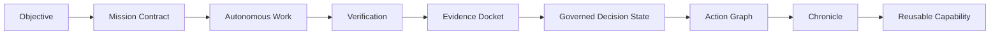
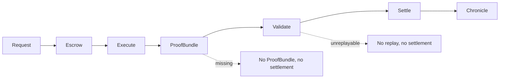
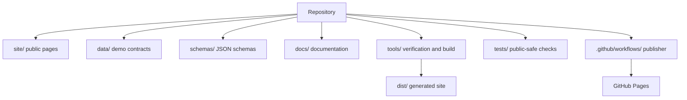

# Architecture

GoalOS AGIJobManager Ascension is a static website with browser-local demonstrations, public-safe data contracts, JSON schemas, dependency-free tools/tests, and an autonomous GitHub Pages publisher. Expert-only pages are separated from public-safe demos and must not be treated as casual public demo routes.

## Layers

| Layer | Directory | Role |
|---|---|---|
| Public pages | `site/` | Static HTML proof surfaces |
| Data contracts | `data/` | Public-safe demo inputs and receipts |
| Schemas | `schemas/` | Validation contracts |
| Tools | `tools/` | Build, verification, route, and kernel checks |
| Tests | `tests/` | Dependency-free public-safe checks |
| Publisher | `.github/workflows/goalos-agijobmanager-ascension-production-url-autopilot.yml` | GitHub Pages build/review/deploy path |

## Public/private proof boundary

Public surfaces expose commitment hashes, summaries, attestations, receipts, and claim boundaries. Private prompts, raw traces, customer data, confidential workpapers, and private evaluator notes stay private.

## Diagrams

Public-safe boundary: no user data wanted, no forms, no analytics, no cookies, no localStorage/sessionStorage, no public wallet connection, no public token approval, no public network switching, no public transaction broadcast, no funds moved, and no production authority from public demos.

